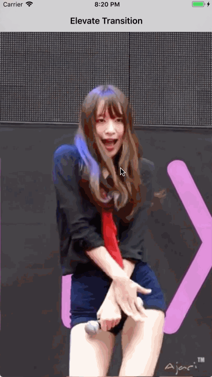

# PureTransition

Custom UIViewController Traansition Animation for qianfan little video sdk.

千帆小视频SDK里一个自定义的转场动画。



# 实现原理

从 iOS7 开始，系统给了开发者自定义转场的能力，束缚你的只是创意而不在是实现方式！这个效果是自定义了 UINavigationController 的 push、pop 转场动画，通过实现 UINavigationController 的代理方法，让系统来我们这里获取实现的动画效果，从而达到了对外开放自动动画的能力。

# 动画原理

既然是转场，那么必然就要有两个 ViewController，且定义为 fromVC 和 toVC，即从 fromVC 过度到 toVC。简单的理解这个动画其实就是：为 fromVC 的 fromView (起点) 截图，做个动画，过度到 toVC 的 toView(终点) 上去。你看到的只是个截图，并不是 拿着 fromView 真的去做动画了。

### push 转场

假设页面是从 RootVC push 到 DetailVC 的，那么看了效果可以白话为：RootVC 的一个view逐渐变小，最终和 DetailVC 的一个view 重合，于此同时 DetailVC 有个淡出的效果。那么写代码的过程实际上就是将白话翻译成 OC 代码的过程，要做这个动画的话，我们需要 RootVC 给我们一个 view，且定义为 fromView 吧，然后我们并不去真正的移动这个 view，而是为这个 view 截图，拿着这个截图去做动画，动画的目的地由 DetailVC 给出，且定义为 toView 吧。那这样一来就可以为 push 定义出两个协议，一个协议是 RootVC 需要实现的 SLElevateFromAnimatorProtocol，另外一个是 DetailVC 需要实现的 SLElevateToAnimatorProtocol：

```objc
@protocol SLElevateFromAnimatorProtocol <NSObject>
@required

/**
 返回fromVC做动画的view
 
 @return a view
 */
- (UIView *)fromViewForAnimatedTransitioning;

@end

@protocol SLElevateToAnimatorProtocol <NSObject>
@required

/**
 返回toVC做动画的view
 
 @return a view
 */
- (UIView *)toViewForAnimatedTransitioning;

@end
```

之所以定义两个协议是为了不耦合，当需要这个自动的 push 动画时，只需要 push 前后的VC 分别实现 from，to协议即可，剩下的事情就交给 PureTransition 去完成就好了，我们不用修改其他代码。

具体的动画逻辑可参考 **SLElevatePushAnimator** 类，里面代码不多，也有详细的注释。

### pop 转场

假设页面是从 DetailVC pop 到 RootVC 的，仔细观察后发现这和 push 过程是一样的，不同的是 from 和 to 交换了：原本 push 的时候充当 from 的 RootVC ，此时变成了 to，原本 push 的时候充当 to 的 DetailVC ，此时变成了 from。动画的代码跟 push 是一样的，所以这个 pop 做的很简单，此时 DetailVC 需要遵循 SLElevateFromAnimatorProtocol 协议，而 RootVC 需要遵循 SLElevateToAnimatorProtocol 协议。


# issue

可能存在的问题：此截图方案有可能无法截取使用 OpenGL 绘制的画面。